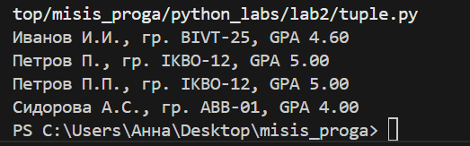

# <h2>ЛР1<h2>
# задание 1

# задание 2

# задание 3

# задание 4

# задание 5

# <h2>ЛР2<h2>

# задание 1

# <h4>Функция 1<h4>

.png)

.png)

.png)

.png)

.png)

# <h4>Функция 2<h4>

.png)

.png)

.png)

.png)

# <h4>Функция 3<h4>

.png)

.png)

.png)

.png)

# задание 2

# <h4>Функция 1<h4>

.png)

.png)

.png)

.png)

.png)

# <h4>Функция 2<h4>

.png)

.png)

.png)

.png)

# <h4>Функция 3<h4>

.png)

.png)

.png)

.png)

# задание 3

