# <h1>ЛР7<h1>

# <h4>test_text.py<h4>

Написала автотесты для всех публичных функций модуля:

normalize(text: str) -> str
tokenize(text: str) -> list[str]
count_freq(tokens: list[str]) -> dict[str, int]
top_n(freq: dict[str, int], n: int) -> list[tuple[str, int]]

Вот код к этому заданию:

```
import pytest
from src.lib.text import normalize, tokenize, count_freq, top_n


def test_normalize_basic():
    """Тест базовых случаев нормализации."""
    assert normalize("ПрИвЕт\nМИр\t") == "привет мир"
    assert normalize("ёжик, Ёлка") == "ежик елка" 
    assert normalize("Hello\r\nWorld") == "hello world"
    assert normalize("  двойные   пробелы  ") == "двойные пробелы"


def test_normalize_edge_cases():
    """Тест граничных случаев нормализации."""
    assert normalize("") == ""
    assert normalize("   ") == ""
    assert normalize("ТЕСТ!") == "тест"  
    assert normalize("раз,два,три") == "раз два три"


def test_tokenize_basic():
    """Тест базовых случаев токенизации."""
    assert tokenize("привет мир") == ["привет", "мир"]
    assert tokenize("раз два три") == ["раз", "два", "три"]
    assert tokenize("одно слово") == ["одно", "слово"]


def test_tokenize_edge_cases():
    """Тест граничных случаев токенизации."""
    assert tokenize("") == []
    assert tokenize("   ") == []

    text = "Привет, мир! Как дела?"
    result = tokenize(text)
    expected = ["привет", "мир", "как", "дела"]  
    assert result == expected


def test_count_freq_basic():
    """Тест базовых случаев подсчета частот."""
    tokens = ["я", "ты", "я", "мы", "ты", "я"]
    result = count_freq(tokens)
    expected = {"я": 3, "ты": 2, "мы": 1}
    assert result == expected


def test_count_freq_edge_cases():
    """Тест граничных случаев подсчета частот."""
    assert count_freq([]) == {}

    tokens = ["слово", "слово", "слово"]
    result = count_freq(tokens)
    expected = {"слово": 3}
    assert result == expected


def test_top_n_basic():
    """Тест базовых случаев получения топ-N."""
    freq = {"я": 5, "ты": 3, "мы": 4, "они": 2}
    result = top_n(freq, 3)
    expected = [("я", 5), ("мы", 4), ("ты", 3)]
    assert result == expected


def test_top_n_tie_breaker():
    """Тест сортировки при одинаковых частотах."""
    freq = {"бета": 2, "альфа": 2, "гамма": 2, "дельта": 1}
    result = top_n(freq, 3)
    expected = [("альфа", 2), ("бета", 2), ("гамма", 2)]
    assert result == expected


def test_top_n_edge_cases():
    """Тест граничных случаев получения топ-N."""
    assert top_n({}, 5) == []
    assert top_n({"слово": 1}, 0) == []

    freq = {"а": 1, "б": 2}
    result = top_n(freq, 5)
    expected = [("б", 2), ("а", 1)]
    assert result == expected


def test_full_pipeline():
    """Интеграционный тест всего пайплайна."""
    text = "Раз два три, раз два три. Раз раз раз!"

    normalized = normalize(text)
    assert normalized == "раз два три раз два три раз раз раз"  

    tokens = tokenize(normalized)
    expected_tokens = ["раз", "два", "три", "раз", "два", "три", "раз", "раз", "раз"]
    assert tokens == expected_tokens

    freq = count_freq(tokens)
    expected_freq = {"раз": 5, "два": 2, "три": 2}
    assert freq == expected_freq

    top_words = top_n(freq, 2)
    expected_top = [("раз", 5), ("два", 2)]
    assert top_words == expected_top

```


# <h4>test_json_csv.py<h4>

Написала автотесты для функций:

json_to_csv(src_path: str, dst_path: str)
csv_to_json(src_path: str, dst_path: str)

Вот код к этому заданию:

```
import pytest
import json
import csv
from pathlib import Path
from src.lab05.json_csv import json_to_csv, csv_to_json


def test_json_to_csv_basic(tmp_path):
    """Тест базовой конвертации JSON в CSV."""
    src = tmp_path / "test.json"
    dst = tmp_path / "test.csv"

    data = [
        {"name": "Алиса", "age": 25},
        {"name": "Боб", "age": 30},
    ]

    src.write_text(json.dumps(data, ensure_ascii=False), encoding="utf-8")
    json_to_csv(str(src), str(dst))

    assert dst.exists()

    with dst.open(encoding="utf-8") as f:
        reader = csv.DictReader(f)
        rows = list(reader)

    assert len(rows) == 2
    assert rows[0]["name"] == "Алиса"
    assert rows[0]["age"] == "25"
    assert rows[1]["name"] == "Боб"
    assert rows[1]["age"] == "30"


def test_json_to_csv_missing_fields(tmp_path):
    """Тест с отсутствующими полями."""
    src = tmp_path / "test.json"
    dst = tmp_path / "test.csv"

    data = [
        {"name": "Алиса", "age": 25},
        {"name": "Боб", "city": "Москва"},
    ]

    src.write_text(json.dumps(data, ensure_ascii=False), encoding="utf-8")
    json_to_csv(str(src), str(dst))

    with dst.open(encoding="utf-8") as f:
        reader = csv.DictReader(f)
        rows = list(reader)

    assert len(rows) == 2
    assert set(rows[0].keys()) == {"name", "age", "city"}
    assert rows[0]["name"] == "Алиса"
    assert rows[0]["city"] == ""
    assert rows[1]["age"] == ""


def test_json_to_csv_file_not_found():
    """Тест с несуществующим файлом."""
    with pytest.raises(FileNotFoundError):
        json_to_csv("nonexistent.json", "output.csv")


def test_json_to_csv_invalid_json(tmp_path):
    """Тест с некорректным JSON."""
    src = tmp_path / "invalid.json"
    dst = tmp_path / "output.csv"

    src.write_text("{ invalid json }", encoding="utf-8")

    with pytest.raises(ValueError):
        json_to_csv(str(src), str(dst))


def test_json_to_csv_empty_json(tmp_path):
    """Тест с пустым JSON."""
    src = tmp_path / "empty.json"
    dst = tmp_path / "output.csv"

    src.write_text("[]", encoding="utf-8")

    with pytest.raises(ValueError):
        json_to_csv(str(src), str(dst))


def test_csv_to_json_basic(tmp_path):
    """Тест базовой конвертации CSV в JSON."""
    src = tmp_path / "test.csv"
    dst = tmp_path / "test.json"

    csv_content = """name,age,city
Алиса,25,Москва
Боб,30,СПб"""

    src.write_text(csv_content, encoding="utf-8")
    csv_to_json(str(src), str(dst))

    assert dst.exists()

    with dst.open(encoding="utf-8") as f:
        data = json.load(f)

    assert len(data) == 2
    assert data[0] == {"name": "Алиса", "age": "25", "city": "Москва"}
    assert data[1] == {"name": "Боб", "age": "30", "city": "СПб"}


def test_csv_to_json_file_not_found():
    """Тест с несуществующим файлом."""
    with pytest.raises(FileNotFoundError):
        csv_to_json("nonexistent.csv", "output.json")


def test_csv_to_json_empty_csv(tmp_path):
    """Тест с пустым CSV."""
    src = tmp_path / "empty.csv"
    dst = tmp_path / "output.json"

    src.write_text("", encoding="utf-8")

    with pytest.raises(ValueError):
        csv_to_json(str(src), str(dst))


def test_round_trip(tmp_path):
    """Тест круговой конвертации JSON->CSV->JSON."""
    original_json = tmp_path / "original.json"
    intermediate_csv = tmp_path / "intermediate.csv"
    final_json = tmp_path / "final.json"

    original_data = [
        {"name": "Алиса", "age": 25},
        {"name": "Боб", "age": 30},
    ]

    original_json.write_text(
        json.dumps(original_data, ensure_ascii=False), encoding="utf-8"
    )

    json_to_csv(str(original_json), str(intermediate_csv))
    csv_to_json(str(intermediate_csv), str(final_json))

    with final_json.open(encoding="utf-8") as f:
        final_data = json.load(f)

    assert len(final_data) == len(original_data)

```


# <h1>ЛР6<h1>


Реализовала модуль src/lab06/cli_text.py с подкомандами:

stats --input [--top 5] — анализ частот слов в тексте;  
cat --input [-n] — вывод содержимого файла построчно.

Вот код к этому заданию:

# <h4>cli_text.py<h4>

```
import argparse
import sys
import os
from pathlib import Path

sys.path.append(r"C:\Users\Анна\Desktop\misis_proga\python_labs\src\lib")
from io_helpers import read_file, read_lines, text_analyzer

def cat_command(input_file, number_lines=False):
    """
    Реализация команды cat с нумерацией строк
    """
    lines = read_lines(input_file)#читает файл построчно, возвращает список строк
    
    for i, line in enumerate(lines, 1):
        if number_lines:
            print(f"{i:6}  {line}", end='')
        else:
            print(line, end='')

def stats_command(input_file, top_n=5):
    """
    Реализация команды stats для анализа частот слов
    """
    text = read_file(input_file)#читает весь файл как одну строку
    top_words = text_analyzer(text, top_n)
    
    print(f"Топ-{top_n} самых частых слов в файле '{input_file}':")
    print("-" * 40)
    for i, (word, freq) in enumerate(top_words, 1):#перебирает слова с нумерацией с 1
        print(f"{i:2}. {word:<20} {freq:>3} раз")

def main():
    parser = argparse.ArgumentParser(description="CLI утилиты для работы с текстом",formatter_class=argparse.RawDescriptionHelpFormatter)
    
    subparsers = parser.add_subparsers(dest="command", help="Доступные команды",required=True)

    # Подкоманда cat
    cat_parser = subparsers.add_parser("cat", help="Вывести содержимое файла построчно")
    cat_parser.add_argument("--input", required=True, help="Путь к входному файлу")
    cat_parser.add_argument("-n", action="store_true", help="Нумеровать строки")

    # Подкоманда stats
    stats_parser = subparsers.add_parser("stats", help="Анализ частот слов в тексте")
    stats_parser.add_argument("--input", required=True, help="Путь к текстовому файлу")
    stats_parser.add_argument("--top", type=int, default=5, help="Количество топ-слов для вывода (по умолчанию: 5)")

    args = parser.parse_args()

    try:
        if args.command == "cat":
            cat_command(args.input, args.n)
        elif args.command == "stats":
            stats_command(args.input, args.top)
            
    except FileNotFoundError as e:
        print(f"Ошибка: {e}", file=sys.stderr)
        sys.exit(1)
    except Exception as e:
        print(f"Неожиданная ошибка: {e}", file=sys.stderr)
        sys.exit(1)

if __name__ == "__main__":
    main()
```

# <h4>cli_text.py<h4>

Вот результат работы команды cat:

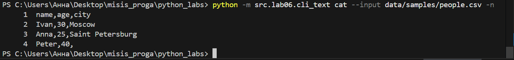

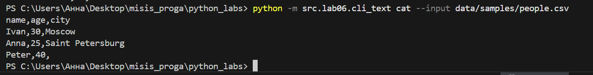

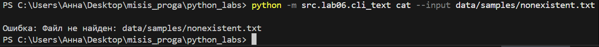

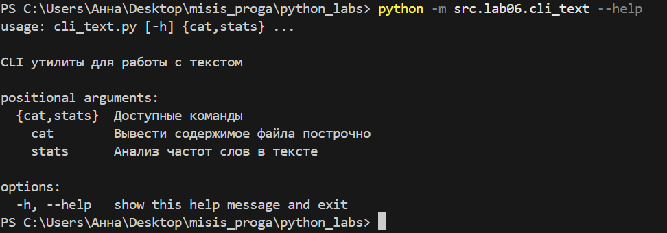

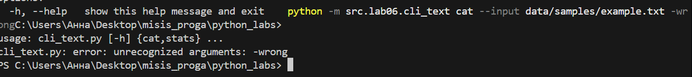

Вот результат работы команды stat:


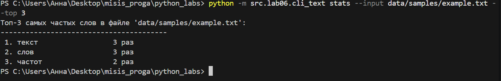

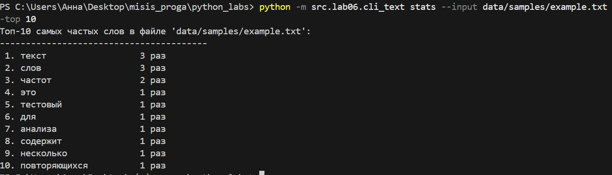


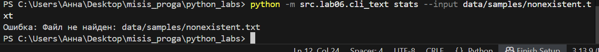


# cli_convert.py

Реализовала модуль src/lab06/cli_convert.py с подкомандами:

json2csv --in data/samples/people.json --out data/out/people.csv - преобразование json файла в csv  
csv2json --in data/samples/people.csv --out data/out/people.json - преобразование csv файла в json  
csv2xlsx --in data/samples/people.csv --out data/out/people.xlsx - преобразование csv файла в xlsx  

Вот код к этому заданию:
```
import argparse
import sys
import os
from pathlib import Path

sys.path.append(r"C:\Users\Анна\Desktop\misis_proga\python_labs\src\lab05")
from json_csv import json_to_csv, csv_to_json
from csv_xlsx import csv_to_xlsx

def json2csv_command(args):
    """Обработка команды json2csv"""
    try:
        if not os.path.exists(args.input):
            raise FileNotFoundError(f"Файл не найден: {args.input}")
        
        json_to_csv(args.input, args.output)
        print(f"Успешно конвертировано: {args.input} -> {args.output}")
        
    except Exception as e:
        print(f"Ошибка: {e}", file=sys.stderr)
        sys.exit(1)

def csv2json_command(args):
    """Обработка команды csv2json"""
    try:
        if not os.path.exists(args.input):
            raise FileNotFoundError(f"Файл не найден: {args.input}")
        
        csv_to_json(args.input, args.output)
        print(f"Успешно конвертировано: {args.input} -> {args.output}")
        
    except Exception as e:
        print(f"Ошибка: {e}", file=sys.stderr)
        sys.exit(1)

def csv2xlsx_command(args):
    """Обработка команды csv2xlsx"""
    try:
        if not os.path.exists(args.input):
            raise FileNotFoundError(f"Файл не найден: {args.input}")
        
        csv_to_xlsx(args.input, args.output)
        print(f"Успешно конвертировано: {args.input} -> {args.output}")
        
    except Exception as e:
        print(f"Ошибка: {e}", file=sys.stderr)
        sys.exit(1)

def main():
    parser = argparse.ArgumentParser(
        description="CLI-конвертеры данных между форматами JSON, CSV и XLSX",
        formatter_class=argparse.RawDescriptionHelpFormatter,
        epilog="""
Примеры использования:
  python -m src.lab06.cli_convert json2csv --in people.json --out people.csv
  python -m src.lab06.cli_convert csv2json --in people.csv --out people.json
  python -m src.lab06.cli_convert csv2xlsx --in people.csv --out people.xlsx

        """
    )
    
    subparsers = parser.add_subparsers(dest="command", help="Доступные команды конвертации", required=True)
    
    # Подкоманда json2csv
    json2csv_parser = subparsers.add_parser("json2csv", help="Конвертировать JSON в CSV")
    json2csv_parser.add_argument("--in", dest="input", required=True, help="Входной JSON файл")
    json2csv_parser.add_argument("--out", dest="output", required=True, help="Выходной CSV файл")
    json2csv_parser.set_defaults(func=json2csv_command)
    
    # Подкоманда csv2json
    csv2json_parser = subparsers.add_parser("csv2json", help="Конвертировать CSV в JSON")
    csv2json_parser.add_argument("--in", dest="input", required=True, help="Входной CSV файл")
    csv2json_parser.add_argument("--out", dest="output", required=True, help="Выходной JSON файл")
    csv2json_parser.set_defaults(func=csv2json_command)
    
    # Подкоманда csv2xlsx
    csv2xlsx_parser = subparsers.add_parser("csv2xlsx", help="Конвертировать CSV в XLSX")
    csv2xlsx_parser.add_argument("--in", dest="input", required=True, help="Входной CSV файл")
    csv2xlsx_parser.add_argument("--out", dest="output", required=True, help="Выходной XLSX файл")
    csv2xlsx_parser.set_defaults(func=csv2xlsx_command)
    
    args = parser.parse_args()
    args.func(args)

if __name__ == "__main__":
    main()
```

# <h4>cli_convert.py<h4>

Вывод:


Содержимое файла:

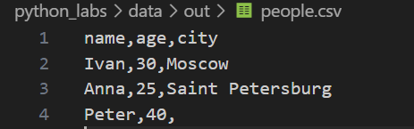

Вывод:

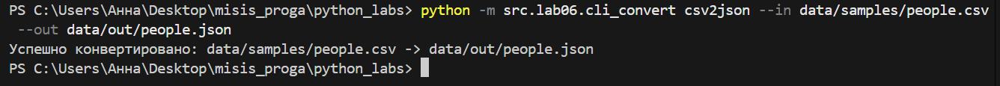

Содержимое файла:

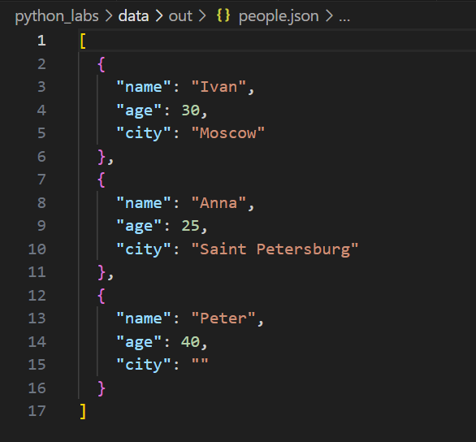

Вывод:

.png)


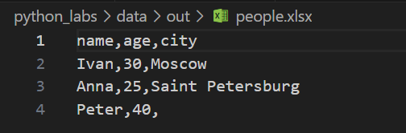


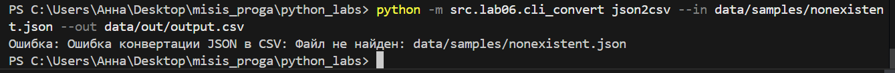


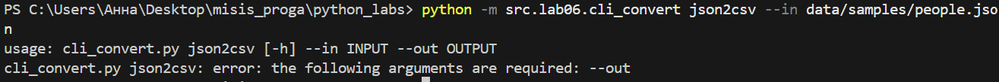

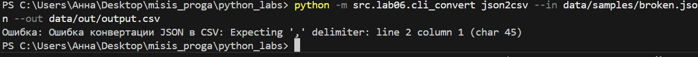

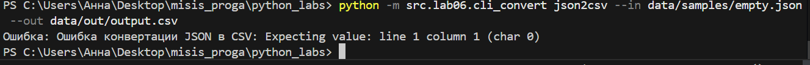


# <h1>ЛР5<h1>

# задание A

Функции:  

json_to_csv - преобразует JSON-файл в CSV-файл. Он читает JSON, определяет колонки по первому объекту, заполняет отсутствующие поля пустыми строками и сохраняет данные в CSV.  

csv_to_json - преобразует CSV-файл обратно в JSON. Он читает CSV и создает список словарей, который затем сохраняет в JSON-файл.  

```
import json
import csv
from pathlib import Path

def json_to_csv(json_path: str, csv_path: str) -> None:
    """
    Преобразует JSON-файл в CSV.
    Поддерживает список словарей [{...}, {...}], заполняет отсутствующие поля пустыми строками.
    Порядок колонок — как в первом объекте.
    """
    json_file = Path(json_path)#Создаем объект пути json_file, чтобы удобно работать с файлом

    #Проверка, что на вход подаётся точно json формат
    if not json_path.endswith('.json'):
        raise ValueError("Файл должен иметь расширение .json")

    # Проверка наличия файла
    if not json_file.exists():
        raise FileNotFoundError(f"Файл не найден: {json_path}")

    # Чтение JSON
    with json_file.open("r", encoding="utf-8") as f:
        try:
            data = json.load(f)#Пытаемся загрузить содержимое файла как JSON
        except json.JSONDecodeError:
            raise ValueError("Некорректный формат JSON")
        
        # Проверка, что JSON - список
        if not isinstance(data, list):
            raise ValueError("JSON не является списком объектов")
        if len(data) == 0:
            raise ValueError("Пустой JSON или неподдерживаемая структура")
        
        # Проверка, что все элементы - словари
        if not all(isinstance(item, dict) for item in data):
            raise ValueError("Некоторые элементы JSON не являются объектами")

        # Определение заголовков по первому элементу
        headers = list(data[0].keys())

        # Заполняем отсутствующие ключи
        for item in data:
            for key in headers:
                if key not in item:
                    item[key] = ""

    # Запись CSV
    with open(csv_path, "w", newline="", encoding="utf-8") as f:
        writer = csv.DictWriter(f, fieldnames=headers)#пишет словари как строки csv, зная названия колонок
        writer.writeheader()#записывает 1 строку с названиями колонок
        for row in data:
            writer.writerow(row)#каждый элемент пишется как строка csv

def csv_to_json(csv_path: str, json_path: str) -> None:
    """
    Преобразует CSV в JSON (список словарей).
    Значения сохраняются как строки.
    """
    csv_file = Path(csv_path)#создаём объект пути для файла

    #Проверка, что на вход подаётся csv-формат
    if not csv_path.endswith('.csv'):
        raise ValueError("Файл должен иметь расширение .csv")
        
    # Проверка наличия файла
    if not csv_file.exists():
        raise FileNotFoundError(f"Файл не найден: {csv_path}")

    with open(csv_path, "r", encoding="utf-8") as f:
        try:
            # Проверка наличия данных
            # Используем csv.reader для определения наличия заголовка и данных
            reader = csv.reader(f)
            # Переместимся обратно в позицию для DictReader
            f.seek(0)
            # Используем DictReader
            dict_reader = csv.DictReader(f)
            headers = dict_reader.fieldnames

            if headers is None or len(headers) == 0:
                raise ValueError("CSV без заголовка")
            # Проверка наличия данных
            data_rows = list(dict_reader)
            if len(data_rows) == 0:
                raise ValueError("Пустой CSV")
        except csv.Error as e:
            raise ValueError(f"Ошибка при чтении CSV: {e}")

    # В JSON значения сохраняются как строки
    with open(json_path, "w", encoding="utf-8") as jf:
        json.dump(data_rows, jf, ensure_ascii=False, indent=2)
json_to_csv(
    'C:/Users/Анна/Desktop/misis_proga/python_labs/data/samples/people.json',
    'C:/Users/Анна/Desktop/misis_proga/python_labs/data/out/output.csv'
)

csv_to_json(
    'C:/Users/Анна/Desktop/misis_proga/python_labs/data/samples/people.csv',
    'C:/Users/Анна/Desktop/misis_proga/python_labs/data/out/output.json'
)
```

# <h4>Задание А<h4>

people.json

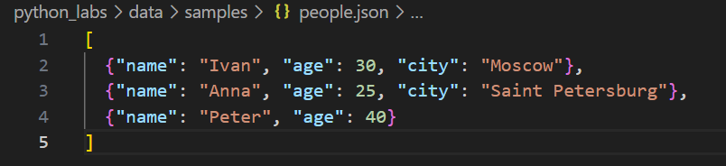

people.csv

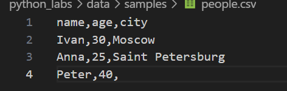

people_from_csv.json

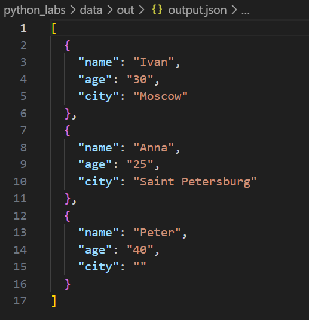

people_from_json.csv

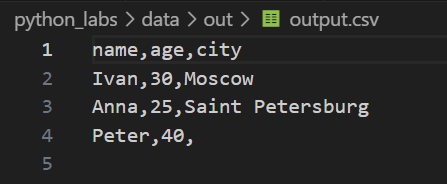

# задание B

Этот скрипт выполняет преобразование CSV-файла в формат Excel:

- Читает данные из указанного CSV-файла.  
- Создает новый Excel-файл с названием  
- Записывает в него заголовки и все строки из CSV.  
- Автоматически устанавливает ширину колонок так, чтобы в них полностью помещалось самое длинное содержимое, при этом минимальная ширина - 8 символов.  

Используется библиотека `openpyxl` для работы с Excel и встроенный модуль `csv`. 
```
from openpyxl import Workbook
import csv
from pathlib import Path

def csv_to_xlsx(csv_path: str, xlsx_path: str) -> None:
    """
    Конвертирует CSV в XLSX. Использует openpyxl.
    - Первый ряд CSV - заголовки.
    - Лист называется "Sheet1".
    - Колонки - автоширина по длине текста (минимум 8 символов).
    
    Ошибки:
    - FileNotFoundError, если файл не существует.
    - ValueError при пустом или некорректном файле.
    """
    csv_file = Path(csv_path)
    if not csv_file.exists():
        raise FileNotFoundError(f"Файл не найден: {csv_path}")
    # Проверка наличия файла
    if not json_file.exists():
        raise FileNotFoundError(f"Файл не найден: {json_path}")
    #Проверка, что на вход подаётся csv-формат
    if not csv_path.endswith('.csv'):
        raise ValueError("Файл должен иметь расширение .csv")
    # Чтение CSV
    with csv_file.open("r", encoding="utf-8") as f:
        reader = csv.reader(f)
        rows = list(reader)
    
    if not rows:#проверка:если список rows пустой 
        raise ValueError("Пустой CSV файл.")
    header = rows[0]
    data_rows = rows[1:]
    
    if not header:
        raise ValueError("CSV без заголовка.")
    
    # Создание книги и листа
    wb = Workbook()
    ws = wb.active
    ws.title = "Sheet1"
    
    # Запись заголовков
    ws.append(header)
    
    # Запись данных
    for row in data_rows:
        ws.append(row)
    
    # Установка автоширины колонок
    for col_idx, col_cells in enumerate(zip(*rows)):
        max_length = max(len(str(cell)) for cell in col_cells)
        # Минимальная ширина 8
        adjusted_width = max(max_length + 2, 8)
        col_letter = ws.cell(row=1, column=col_idx + 1).column_letter
        ws.column_dimensions[col_letter].width = adjusted_width
    
    # Сохранение файла
    xlsx_path_obj = Path(xlsx_path)
    wb.save(str(xlsx_path_obj))

csv_to_xlsx(
    'C:/Users/Анна/Desktop/misis_proga/python_labs/data/samples/people.csv',
    'C:/Users/Анна/Desktop/misis_proga/python_labs/data/out/output.xlsx'
)
```

# <h4>Задание B<h4>

csv-файл:


xlsx-файл:

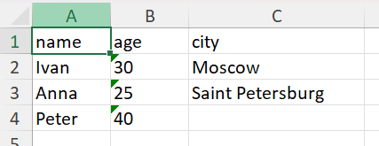

Если файл пустой:

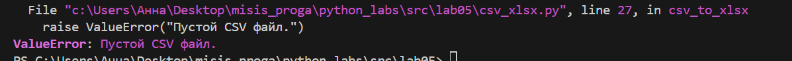

# <h1>ЛР1<h1>
# задание 1

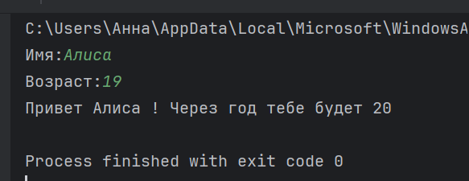

# задание 2


# задание 3
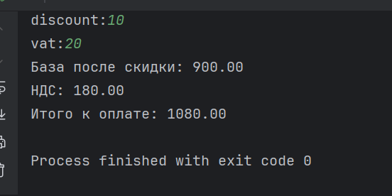

# задание 4
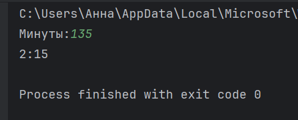

# задание 5
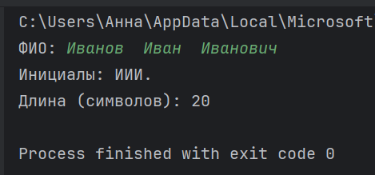

# <h1>ЛР2<h1>

# задание 1

В 1 задании реализованы функции min_max() для нахождения минимума и максимума, unique_sorted() для сортировки уникальных значений по возрастанию, flatten() для "расплющивания" матрицы.

```
nums = []
n = int(input())
for i in range(n):
    s = input()
    if '.' in s:
        number = float(s)
    else:
        number = int(s)
    nums.append(number)
print(nums)

def min_max(nums):
    if len(nums) == 0:
        return "ValueError"
    return (min(nums), int(max(nums)))

def unique_sorted(nums):
    return sorted(set(nums))

def flatten(mat):
    # Если вход - кортеж, преобразуем его в список
    if isinstance(mat, tuple):
        mat = list(mat)

    listt = []
    for sublist in mat:  # могут быть и списки, и кортежи
        # Определяем возможные вложенные кортежи/списки
        if isinstance(sublist, (list, tuple)):
            for item in sublist:
                # Проверка, является ли item числом или строкой
                if isinstance(item, str):#если элемент - строка
                    if not item.isdigit():
                        return 'TypeError'
                    else:
                        listt.append(int(item))
                elif isinstance(item, (int, float)):#если элемент - число
                    listt.append(item)
                else:
                    return 'TypeError'
        else:
            # Если внутри не список/кортеж, возможно, ошибка
            return 'TypeError'
    return listt

n = int(input("Сколько списков вы хотите создать? "))
mat = []
for i in range(n):
    elements = input(f"Введите числа для списка {i + 1} через пробел: ")
    inner_list = elements.split()
    mat.append(inner_list)
print(flatten([(1, 2), (3, 4)]))
print(flatten([[1, 2], [3, 4]]))
print(min_max(nums))
print(unique_sorted(nums))
print(flatten(mat))
```

# <h4>Функция 1<h4>

.png)

.png)

.png)

.png)

.png)

# <h4>Функция 2<h4>

.png)

.png)

.png)

.png)

# <h4>Функция 3<h4>

.png)

.png)

.png)

.png)

# задание 2

Во 2 задании реализованы функции transpose() для замены строк на столбцы, row_sums() для того, чтобы посчитать сумму по каждой строке, col_sums() для того, чтобы посчитать сумму по каждому столбцу.

```
n = int(input("Введите количество строк: "))
mat = []

# Ввод строк
for i in range(n):
    elements = input(f"Введите элементы для строки {i + 1} через пробел: ").split()
    mat.append(elements)

rows = len(mat)

# Если матрица пустая
if rows == 0:
    print('[]')
    exit()

cols = len(mat[0])

# Проверка, есть ли у каких-то строк меньшая длина (рваная матрица)
for i in range(rows):
    if len(mat[i]) != cols:
        print('ValueError')
        exit()

# Проверка, есть ли пустой элемент внутри матрицы
for i in range(rows):
    for j in range(len(mat[i])):  # перебираем только существующие элементы
        if mat[i][j] == '':
            print('ValueError')
            exit()

# Проверка, является ли матрица квадратной
if rows == cols:
    print('[0, 0]')
    exit()

def row_sums(matrix):
    result = []#суммы строк
    for row in matrix:
        converted = []#хранение чисел из строки
        for item in row:
            # Пытаемся преобразовать сначала в int
            try:
                num = int(item)
                converted.append(num)
            except ValueError:
                # Если не получилось, пробуем float
                try:
                    num = float(item)
                    converted.append(num)
                except ValueError:
                    return "ValueError"
        # Суммируем
        total = sum(converted)
        # Если сумма — целое число, выводим как int
        if isinstance(total, float) and total.is_integer():#является ли сумма числом с плавающей точкой и при этом она равна целому числу
            total = int(total)
        result.append(total)
    return result
print(row_sums(mat))


def transpose(matrix):
    # Проверка, что матрица не пуста и все строки одинаковой длины
    if len(matrix) == 0:
        return []

    row_length = len(matrix[0])  # количество столбцов
    # Проверка на рваность
    for row in matrix:
        if len(row) != row_length:
            return "ValueError"

    # Создаем новую матрицу для транспонированных данных
    transposed = []
    # Перебираем каждый столбец (по индексу)
    for i in range(row_length):
        new_row = []
        # Собираем элементы из каждого ряда в этот столбец
        for row in matrix:
            new_row.append(row[i])
        transposed.append(new_row)
    return transposed
print(transpose(mat))

def col_sums(mat):
    if len(mat) == 0:
        return []
    
    row_len = len(mat[0])#количество столбцов
    for row in mat:#проверка на рванность матрицы
        if len(row) != row_len:
            return "ValueError"
        
    numeric_mat = []
    for row in mat:
        numeric_row = []
        for item in row:
            try:
                num = int(item)
            except ValueError:
                try:
                    num = float(item)
                except ValueError:
                    return "ValueError"
            numeric_row.append(num)
        numeric_mat.append(numeric_row)
    return [sum(row[j] for row in numeric_mat) for j in range(row_len)]
print(col_sums(mat))
```

# <h4>Функция 1<h4>

.png)

.png)

.png)

.png)

.png)

# <h4>Функция 2<h4>

.png)

.png)

.png)

.png)

# <h4>Функция 3<h4>

.png)

.png)

.png)

.png)

# задание 3

В 3 задании реализована функция format_record() для записи информации о студенте(Инициалы, группа, gpa)

```
def format_record(rec):
    fio, group, gpa = rec#переменные кортежа

    fio = " ".join(fio.strip().split())#удаляем пробелы в начале и в конце строки фио;разделяем строку по пробелам;объединяем список слов обратно;остались только слова через 1 пробел
    group = group.strip()#Убираем пробелы в начале и конце строки с группой

    if fio == '' or group == '':
        return ValueError
    if not isinstance(gpa, (float, int)):#проверка: гпа число или нет
        raise TypeError("ГПА должно быть числом")
    parts = fio.split()#разделяем строку фио на отдельные слова
    if len(parts) < 2:
        raise ValueError("ФИО должно содержать минимум фамилию и имя")
    surname = parts[0].capitalize()#записываем фамилию и делаем 1 буквы заглавной
    #Создаём инициалы
    initials = "".join([p[0].upper() + "." for p in parts[1:3]])#берём все слова, которые есть после фамилии; берём 1 букву для каждого слова из среза и делаем их заглавными;добавляем точку
    return f"{surname} {initials}, гр. {group}, GPA {gpa:.2f}"

# Примеры
print(format_record(("Иванов Иван Иванович", "BIVT-25", 4.6)))
print(format_record(("Петров Пётр", "IKBO-12", 5.0)))
print(format_record(("Петров Пётр Петрович", "IKBO-12", 5.0)))
print(format_record(("  сидорова  анна   сергеевна ", "ABB-01", 3.999)))
```
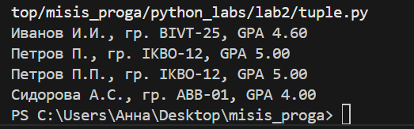

# <h1>ЛР3<h1>

# задание A

В задании А реализованы 3 функции, которые позволяют:

превратить любой текст в однородный вид (normalize),
разбить текст на слова (tokenize),
посчитать, как часто встречаются слова (count_freq),
узнать, какие слова встречаются чаще всего (top_n).

```
def normalize(text: str, *, casefold: bool = True, yo2e: bool = True) -> str:
    # Заменяем управляющие символы \r, \n, \t на пробелы
    text = text.replace('\r', ' ').replace('\n', ' ').replace('\t', ' ')

    # Замена ё/Ё на е/Е
    if yo2e:
        text = text.replace('ё', 'е').replace('Ё', 'Е')

    # Применение casefold (если требуется) с обработкой ошибок
    '''Если мы хотим делать все буквы маленькими, то сначала пытаемся использовать casefold(), которая очень хорошо переводит все буквы в маленькие и делает слова одинаковыми.
Если casefold() не работает, тогда используем lower() — тоже превращает буквы в маленькие.'''
    if casefold:
        try:
            text = text.casefold()
        except AttributeError:
            text = text.lower()

    # Схлопываем подряд идущие пробелы в один и удаляем пробелы по краям
    result_chars = []#сюда будем добавлять буквы
    prev_space = False#флажок, который говорит, был ли предыдущий символ пробелом.
    for ch in text:
        if ch.isspace():#Если символ — это пробел или похожий знак (isspace() значит — пробел, табуляция или перевод строки),
            if not prev_space:#если не пробел --> True
                result_chars.append(' ')
                prev_space = True
        else:
            result_chars.append(ch)#не является пробелом, значит добавляем текущий символ ch в итоговый список.
            prev_space = False#обнуляем флаг
    normalized_text = ''.join(result_chars).strip()#удаление лишних пробелов с начала и с конца
    #Объединяем список символов result_chars в строку.
    return normalized_text


def tokenize(text: str) -> list[str]:
    tokens = []#список хранения итоговых токенов
    current_word = []#список символов текущего слова

    def is_word_char(c):#возвращает True, если символ - буква, цифра, подчёркивание или дефис
        return c.isalnum() or c in ['_', '-']

    for c in text:
        if is_word_char(c):
            current_word.append(c)
        elif c == '-':
            # дефис внутри слова — добавляем, если слово уже есть
            if current_word:
                current_word.append(c)
        else:
            # разделитель
            if current_word:
                tokens.append(''.join(current_word))#Объединяет символы в строку и добавляет в список tokens
                current_word = []#сброс списка для следующего слова
    #После завершения цикла, если есть ещё незанесённое слово, добавляем его.
    if current_word:
        tokens.append(''.join(current_word))
    return tokens

#для каждого токена увеличивает значение по ключу token на 1
def count_freq(tokens: list[str]) -> dict:
    freq = {}
    for token in tokens:
        freq[token] = freq.get(token, 0) + 1
    return freq#словарь, где ключ — токен, значение — количество

#сортирует пары в словаре по убыванию частоты(-item[1])(если равны, по алфавиту(item[0])); возвращает первые n элементов из отсортированного списка
def top_n(freq: dict, n: int = 5) -> list:
    return sorted(freq.items(), key=lambda item: (-item[1], item[0]))[:n]

#тесты

# normalize
assert normalize("ПрИвЕт\nМИр\t") == "привет мир"
assert normalize("ёжик, Ёлка") == "ежик, елка"

# tokenize
assert tokenize("привет, мир!") == ["привет", "мир"]
assert tokenize("по-настоящему круто") == ["по-настоящему", "круто"]
assert tokenize("2025 год") == ["2025", "год"]

# count_freq + top_n
freq = count_freq(["a","b","a","c","b","a"])
assert freq == {"a":3, "b":2, "c":1}
assert top_n(freq, 2) == [("a",3), ("b",2)]

# тай-брейк по слову при равной частоте
freq2 = count_freq(["bb","aa","bb","aa","cc"])
assert top_n(freq2, 2) == [("aa",2), ("bb",2)]
```

# <h4>Задание А<h4>

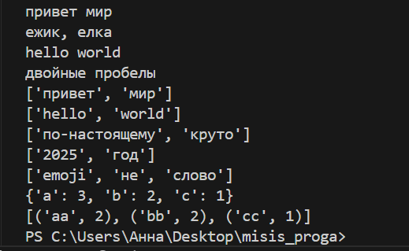

# задание B

Скрипт читает одну строку текста, вызывает функции из lib/text.py и печатает:

Всего слов:
Уникальных слов:
Топ-5:
Частоту повторений слов:
```
import sys
sys.path.append(r"C:\Users\Анна\Desktop\misis_proga\python_labs\src\lib")
from text import normalize, tokenize, count_freq, top_n

text = input()
norm_txt = normalize(text)
token = tokenize(norm_txt)
freq = count_freq(token)#создает словарь, где ключ — слово, значение — сколько раз оно встречается.
top_5 = top_n(freq, n=5)#получает список из 5 наиболее часто встречающихся слов.
print(f"Всего слов: {len(token)}")
print(f"Уникальных слов: {len(freq.keys())}")# длина всех ключей в словаре
print(f"Топ-5:")
for i in top_5:
    print(f"{i[0]}:{i[1]}")
```

# <h4>Задание B<h4>

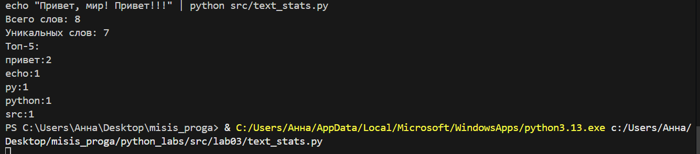

# <h1>ЛР4<h1>

# задание A

1.Открывает файл на чтение в указанной кодировке.  
2.Обрабатывает ошибки.  
3.Создаёт/перезаписывает CSV с разделителем.  
4.Создаёт родительские директории, если их нет.  

```
from pathlib import Path
import csv
from typing import Sequence, Iterable, Union

PathLike = Union[str, Path]

#принимает на вход путь к файлу(path) и кодировку(encoging)
def read_text(path: PathLike, encoding: str = "utf-8") -> str:
    """
    Считать текст из файла как одну строку.

    Args:
        path: Путь к файлу (строка или Path).
        encoding: Кодировка для чтения (по умолчанию "utf-8").

    Returns:
        Содержимое файла в виде строки.

    Пример выбора другой кодировки:
        read_text("file.txt", encoding="cp1251")
    """
    p = Path(path)#создаёт объект path из переменной path и записывает в переменную p
    with p.open('r', encoding=encoding) as file:
        content = file.read()#читает файл целиком
        #возвращается содержимое или пустая строка, если файл пустой
        return content if content is not None else ""
    # Если файл пустой, content будет ""

def parent_dir(path: PathLike) -> None:
    """
    Создаёт родительские директории указанного пути, если их нет.

    Args:
        path: Путь к файлу (строка или Path).
    """
    p = Path(path)
    parent = p.parent#Получает родительскую директорию пути
    if not parent.exists():#exists() возвращает True, если папка(или файл) есть в файловой системе
        parent.mkdir(parents=True, exist_ok=True)
#parents=True — если надо, создаст все промежуточные папки, которых нет
#Параметр exist_ok=True — не выдаст ошибку, если папка уже существует.

def write_csv(rows, path, header=None):
    """
    Записать данные в CSV файл с разделителем ','.

    Args:
        rows: Список строк (кортежей или списков) с данными.
        path: Путь к CSV файлу (строка или Path).
        header: Кортеж заголовка (имён столбцов), если указан — записывается первой строкой.

    Raises:
        ValueError: Если длины строк в rows не совпадают.
    """
    if not rows:#Проверка, пустой ли список rows
        # Нечего проверять, но если header есть — файл будет с одним заголовком
        length = len(header) if header is not None else 0
    else:
        length = len(rows[0])#length — длина первой строки в списке данных.
        #i — индекс текущей строки в списке; r — сама текущая строка (список или кортеж с элементами)
        for i, r in enumerate(rows):
            if len(r) != length:
                raise ValueError
#Перед созданием файла вызывается функция, чтобы убедиться, что папка для файла существует. Если нет — она будет создана.
    parent_dir(path)

    p = Path(path)
    #f — переменная, которая ссылается на открытый файловый объект
    with p.open("w", newline="", encoding="utf-8") as f:
        writer = csv.writer(f)#принимает файловый объект и умеет записывать данные в файл в формате CSV (то есть строки с разделителями)
        if header is not None:
            if len(header) != length:
                raise ValueError
            writer.writerow(header)#Если заголовок указан, вызывается writer.writerow(header) — запись заголовка как первой строки CSV-файла.
        for row in rows:#Итерация по всем строкам данных rows
            writer.writerow(row)
#все данные записываются построчно под заголовком(если он был)

#пример для README
if __name__ == "__main__":
    try:
        text = read_text("data/input.txt")
        print("Прочитан текст (первые 100 символов):")
        print(text[:100])
    except Exception as e:
        print("Ошибка при чтении файла:", e)

    # запись CSV с заголовком и несколькими строками
    try:
        #создаём массив данных row, записываем их в файл с заголовками
        rows = [("test", 3), ("apple", 3), ("banana", 5), ("orange", 2)]
        write_csv(rows, "data/output.csv", header=("word", "count"))
        print("CSV записан: data/output.csv")
    except Exception as e:
        print("Ошибка при записи CSV:", e)
```

# <h4>Задание А<h4>
Если в файле что-то написано:

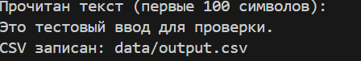

Если файл пустой:

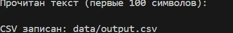

# задание B

Скрипт читает input.txt , вызывает функции из lib/text.py и печатает:  
Всего слов:  
Уникальных слов:  
Топ-5:  
Частоту повторений слов:  
```
import sys
import argparse
sys.path.append(r"C:\Users\Анна\Desktop\misis_proga\python_labs\src\lib")
from text import normalize, tokenize, count_freq, top_n
from io_txt_csv import read_text, write_csv

def main():
    # Создаем объект для чтения аргументов командной строки
    parser = argparse.ArgumentParser()

    #Считаем аргументы:
    # --in — входной файл("data/input.txt")
    parser.add_argument("--in", dest="input_file", default="data/input.txt")
    # --out — выходной файл("data/report.csv")
    parser.add_argument("--out", dest="output_file", default="data/report.csv")
    # --encoding — кодировка файла("utf-8")
    parser.add_argument("--encoding", default="utf-8")
    
    # Распарсиваем аргументы из командной строки
    args = parser.parse_args()

    # Попытка открыть и прочитать входной файл
    try:
        text = read_text(args.input_file)
    except FileNotFoundError:
        print("Файл не найден")
        sys.exit()  # выходим из программы при ошибке

    # Обрабатываем текст: делаем его нормальным и делим на слова
    text = normalize(text)
    tokens = tokenize(text)

    # Подсчитываем, сколько раз каждое слово встречается
    freq = count_freq(tokens)

    # Сортируем слова по количеству встреч
    sorted_words = sorted(freq.items(), key=lambda x: x[1], reverse=True)

    # Создаем таблицу данных для отчета
    header = ["word", "count"]
    data = [[word, count] for word, count in sorted_words]
    # Записываем результат в CSV файл
    write_csv(data, args.output_file, header)

    # Выводим статистику
    total_words = sum(freq.values())  # Общее число всех слов
    unique_words = len(freq)           # Количество уникальных слов
    print(f"Всего слов: {total_words}")
    print(f"Уникальных слов: {unique_words}")
    print("Топ-5 слов:")
    for word, count in top_n(freq, 5):
        print(f"{word} - {count}")

if __name__ == "__main__":
    main()
```

# <h4>Задание B<h4>

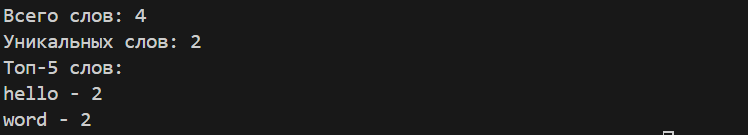

Содержимое файла report.csv

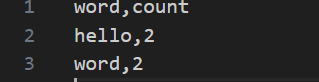

Содержимое файла input.txt

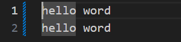

# <h1>ЛР5<h1>

# задание A

Функции:  

json_to_csv - преобразует JSON-файл в CSV-файл. Он читает JSON, определяет колонки по первому объекту, заполняет отсутствующие поля пустыми строками и сохраняет данные в CSV.  

csv_to_json - преобразует CSV-файл обратно в JSON. Он читает CSV и создает список словарей, который затем сохраняет в JSON-файл.  

```
import json
import csv
from pathlib import Path

def json_to_csv(json_path: str, csv_path: str) -> None:
    """
    Преобразует JSON-файл в CSV.
    Поддерживает список словарей [{...}, {...}], заполняет отсутствующие поля пустыми строками.
    Порядок колонок — как в первом объекте.
    """
    json_file = Path(json_path)#Создаем объект пути json_file, чтобы удобно работать с файлом

    #Проверка, что на вход подаётся точно json формат
    if not json_path.endswith('.json'):
        raise ValueError("Файл должен иметь расширение .json")

    # Проверка наличия файла
    if not json_file.exists():
        raise FileNotFoundError(f"Файл не найден: {json_path}")

    # Чтение JSON
    with json_file.open("r", encoding="utf-8") as f:
        try:
            data = json.load(f)#Пытаемся загрузить содержимое файла как JSON
        except json.JSONDecodeError:
            raise ValueError("Некорректный формат JSON")
        
        # Проверка, что JSON - список
        if not isinstance(data, list):
            raise ValueError("JSON не является списком объектов")
        if len(data) == 0:
            raise ValueError("Пустой JSON или неподдерживаемая структура")
        
        # Проверка, что все элементы - словари
        if not all(isinstance(item, dict) for item in data):
            raise ValueError("Некоторые элементы JSON не являются объектами")

        # Определение заголовков по первому элементу
        headers = list(data[0].keys())

        # Заполняем отсутствующие ключи
        for item in data:
            for key in headers:
                if key not in item:
                    item[key] = ""

    # Запись CSV
    with open(csv_path, "w", newline="", encoding="utf-8") as f:
        writer = csv.DictWriter(f, fieldnames=headers)#пишет словари как строки csv, зная названия колонок
        writer.writeheader()#записывает 1 строку с названиями колонок
        for row in data:
            writer.writerow(row)#каждый элемент пишется как строка csv

def csv_to_json(csv_path: str, json_path: str) -> None:
    """
    Преобразует CSV в JSON (список словарей).
    Значения сохраняются как строки.
    """
    csv_file = Path(csv_path)#создаём объект пути для файла

    #Проверка, что на вход подаётся csv-формат
    if not csv_path.endswith('.csv'):
        raise ValueError("Файл должен иметь расширение .csv")
        
    # Проверка наличия файла
    if not csv_file.exists():
        raise FileNotFoundError(f"Файл не найден: {csv_path}")

    with open(csv_path, "r", encoding="utf-8") as f:
        try:
            # Проверка наличия данных
            # Используем csv.reader для определения наличия заголовка и данных
            reader = csv.reader(f)
            # Переместимся обратно в позицию для DictReader
            f.seek(0)
            # Используем DictReader
            dict_reader = csv.DictReader(f)
            headers = dict_reader.fieldnames

            if headers is None or len(headers) == 0:
                raise ValueError("CSV без заголовка")
            # Проверка наличия данных
            data_rows = list(dict_reader)
            if len(data_rows) == 0:
                raise ValueError("Пустой CSV")
        except csv.Error as e:
            raise ValueError(f"Ошибка при чтении CSV: {e}")

    # В JSON значения сохраняются как строки
    with open(json_path, "w", encoding="utf-8") as jf:
        json.dump(data_rows, jf, ensure_ascii=False, indent=2)
json_to_csv(
    'C:/Users/Анна/Desktop/misis_proga/python_labs/data/samples/people.json',
    'C:/Users/Анна/Desktop/misis_proga/python_labs/data/out/output.csv'
)

csv_to_json(
    'C:/Users/Анна/Desktop/misis_proga/python_labs/data/samples/people.csv',
    'C:/Users/Анна/Desktop/misis_proga/python_labs/data/out/output.json'
)
```

# <h4>Задание А<h4>

people.json


people.csv


people_from_csv.json


people_from_json.csv


# задание B

Этот скрипт выполняет преобразование CSV-файла в формат Excel:

- Читает данные из указанного CSV-файла.  
- Создает новый Excel-файл с названием  
- Записывает в него заголовки и все строки из CSV.  
- Автоматически устанавливает ширину колонок так, чтобы в них полностью помещалось самое длинное содержимое, при этом минимальная ширина - 8 символов.  

Используется библиотека `openpyxl` для работы с Excel и встроенный модуль `csv`. 
```
from openpyxl import Workbook
import csv
from pathlib import Path

def csv_to_xlsx(csv_path: str, xlsx_path: str) -> None:
    """
    Конвертирует CSV в XLSX. Использует openpyxl.
    - Первый ряд CSV - заголовки.
    - Лист называется "Sheet1".
    - Колонки - автоширина по длине текста (минимум 8 символов).
    
    Ошибки:
    - FileNotFoundError, если файл не существует.
    - ValueError при пустом или некорректном файле.
    """
    csv_file = Path(csv_path)
    if not csv_file.exists():
        raise FileNotFoundError(f"Файл не найден: {csv_path}")
    # Проверка наличия файла
    if not json_file.exists():
        raise FileNotFoundError(f"Файл не найден: {json_path}")
    #Проверка, что на вход подаётся csv-формат
    if not csv_path.endswith('.csv'):
        raise ValueError("Файл должен иметь расширение .csv")
    # Чтение CSV
    with csv_file.open("r", encoding="utf-8") as f:
        reader = csv.reader(f)
        rows = list(reader)
    
    if not rows:#проверка:если список rows пустой 
        raise ValueError("Пустой CSV файл.")
    header = rows[0]
    data_rows = rows[1:]
    
    if not header:
        raise ValueError("CSV без заголовка.")
    
    # Создание книги и листа
    wb = Workbook()
    ws = wb.active
    ws.title = "Sheet1"
    
    # Запись заголовков
    ws.append(header)
    
    # Запись данных
    for row in data_rows:
        ws.append(row)
    
    # Установка автоширины колонок
    for col_idx, col_cells in enumerate(zip(*rows)):
        max_length = max(len(str(cell)) for cell in col_cells)
        # Минимальная ширина 8
        adjusted_width = max(max_length + 2, 8)
        col_letter = ws.cell(row=1, column=col_idx + 1).column_letter
        ws.column_dimensions[col_letter].width = adjusted_width
    
    # Сохранение файла
    xlsx_path_obj = Path(xlsx_path)
    wb.save(str(xlsx_path_obj))

csv_to_xlsx(
    'C:/Users/Анна/Desktop/misis_proga/python_labs/data/samples/people.csv',
    'C:/Users/Анна/Desktop/misis_proga/python_labs/data/out/output.xlsx'
)
```

# <h4>Задание B<h4>

csv-файл:


xlsx-файл:


Если файл пустой:


